Luidia sarsii africana (LucAfr)
<table><tr><td rowspan=1 colspan=1>Phylum:</td><td rowspan=1 colspan=1>Echinodermata</td></tr><tr><td rowspan=1 colspan=1>Class:</td><td rowspan=1 colspan=1>Asteroidea</td></tr><tr><td rowspan=1 colspan=1>Order:</td><td rowspan=1 colspan=1>Paxillosida</td></tr><tr><td rowspan=1 colspan=1>Family:</td><td rowspan=1 colspan=1>Luidiidae</td></tr><tr><td rowspan=1 colspan=1>Genus:</td><td rowspan=1 colspan=1>Luidia</td></tr><tr><td rowspan=1 colspan=1>Species:</td><td rowspan=1 colspan=1>sarsii africana</td></tr><tr><td rowspan=1 colspan=1>Common name:</td><td rowspan=1 colspan=1>Legs break easily starfish</td></tr></table>

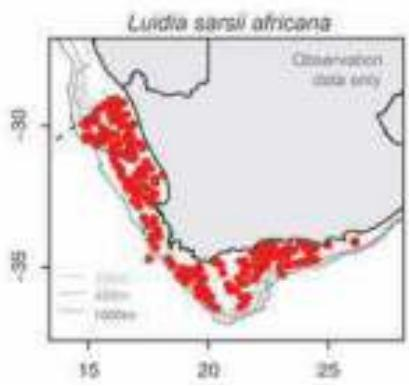

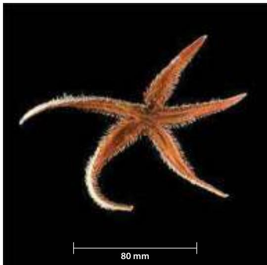

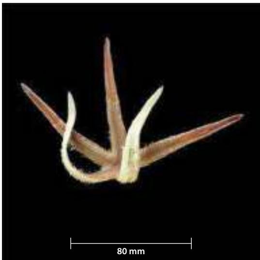

## distinguishing features

Arms usually break off central disc very easily.   
Distinct spines protrude from aboral margin edge;   
arms long, flexible, flattened and tapering, strap-like.   
Usually five arms.

## Colour

Brown to dark pink.

## Size

Average up to 150 mm diameter, but can get larger individuals.

## distribution

Southern African endemic. West and South Coasts of South Africa, to Port Elizabeth; 54 m to 360+ m depth.

## Similar species

Astropecten polyacanthus and Astropecten exilis, however arms of Luidia africana are more flattened and broader, i.e. less tapered, and break off central disc easily.

## references

Clark AM and Downey ME. 1992. Starfishes of the Atlantic (Volume 3). Chapman and Hall: London. p. 20. (794pp.).

Chondraster elattosis (ChoEla)
<table><tr><td rowspan=1 colspan=1>Phylum:</td><td rowspan=1 colspan=1>Echinodermata</td></tr><tr><td rowspan=1 colspan=1>Class:</td><td rowspan=1 colspan=1>Asteroidea</td></tr><tr><td rowspan=1 colspan=1>Order:</td><td rowspan=1 colspan=1>Valvatida</td></tr><tr><td rowspan=1 colspan=1>Family:</td><td rowspan=1 colspan=1>Poraniidae</td></tr><tr><td rowspan=1 colspan=1>Genus:</td><td rowspan=1 colspan=1>Chondraster</td></tr><tr><td rowspan=1 colspan=1>Species:</td><td rowspan=1 colspan=1>elattosis</td></tr><tr><td rowspan=1 colspan=1>Common name:</td><td rowspan=1 colspan=1>Pentagon star</td></tr></table>

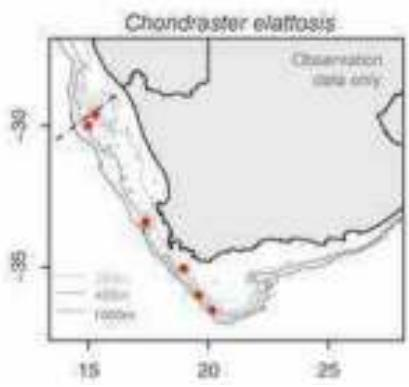

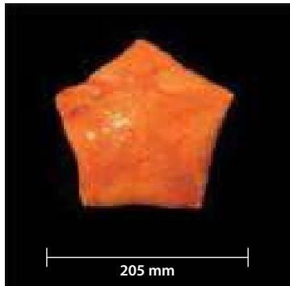

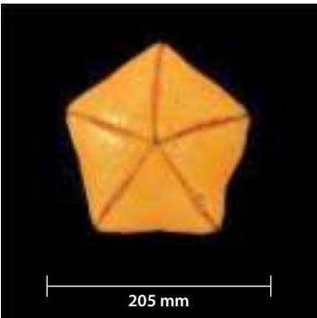

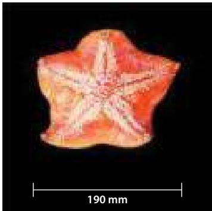

## distinguishing features

Inflexible, rigid star with thick, solid, spongy disc. Pentagonal in shape. Marginal plates indistinct. Distinct madreporite. Fine raised bumps (sheaths of adambulacral spines) form distinct rows along each arm, but no spines apparent. Thick fleshy starfish with smooth aboral and oral surface. Double rows of tube feet. No marginal plates visible. Patterning on aboral surface can be very distinct when brooding (see third image).

## Colour

Bright pink to orange on aboral; pale yellow on oral surface.

## Size

Can reach up to 230 mm diameter.

## distribution

South African endemic. West and South Coasts of South Africa; from 400 to 1 000+ m depth.

## Similar species

Spoladaster veneris, but Chondraster ellatosis does not inflate and is more leathery.

## references

Clark AM and Courtman-Stock J. 1976. The Echinoderms of Southern Africa. British Museum (Natural History): London. pp. 73-74 (277pp.).

Clark AM and Downey ME. 1992. Starfishes of the Atlantic (Volume 3). Chapman and Hall: London. pp. 202-204 (794pp.).

Species identification confirmed by Dr C. Mah, Smithsonian, Washington, June 2015.

<table><tr><td rowspan=1 colspan=2>Spoladaster veneris (SpoBra)</td></tr><tr><td rowspan=1 colspan=1>Phylum:</td><td rowspan=1 colspan=1>Echinodermata</td></tr><tr><td rowspan=1 colspan=1>Class:</td><td rowspan=1 colspan=1>Asteroidea</td></tr><tr><td rowspan=1 colspan=1>Order:</td><td rowspan=1 colspan=1>Valvatida</td></tr><tr><td rowspan=1 colspan=1>Family:</td><td rowspan=1 colspan=1>Poraniidae</td></tr><tr><td rowspan=1 colspan=1>Genus:</td><td rowspan=1 colspan=1>Spoladaster</td></tr><tr><td rowspan=1 colspan=1>Species:</td><td rowspan=1 colspan=1>veneris</td></tr><tr><td rowspan=1 colspan=2>Common name:    Inflated star</td></tr></table>

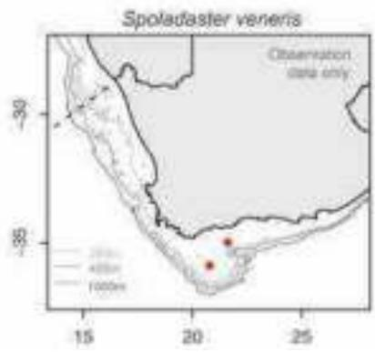

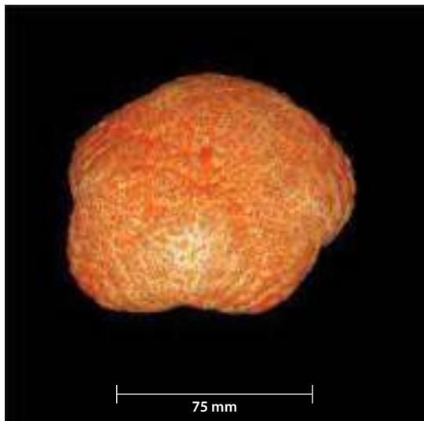

## distinguishing features

Pentagonal in shape, cushion-like body, often inflated when landed (as in photo), but slowly deflates with time out of water. Numerous papillae coat the aboral surface. Ventral smooth with fine lines.

## Colour

Speckled brilliant orange aboral surface and pale cream smooth oral surface.

## Size

Up to 160 mm diameter.

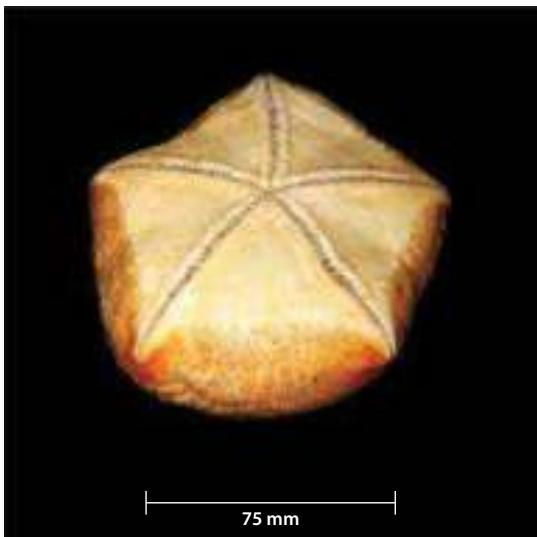

## distribution

West and South Coasts of South Africa; from 40 to 205+ m depth.

## Similar species

Chondraster elattosis, but S. brachyactis inflates and is not as leathery.

## references

Clark AM and Downey ME. 1992. Starfishes of the Atlantic (Volume 3). Chapman and Hall: London. pp. 222-224 (794pp.).

Poraniopsis echinaster (PorEch)
<table><tr><td rowspan=1 colspan=1>Phylum:</td><td rowspan=1 colspan=1>Echinodermata</td></tr><tr><td rowspan=1 colspan=1>Class:</td><td rowspan=1 colspan=1>Asteriodea</td></tr><tr><td rowspan=1 colspan=1>Order:</td><td rowspan=1 colspan=1>Valvatida</td></tr><tr><td rowspan=1 colspan=1>Family:</td><td rowspan=1 colspan=1>Poraniidae</td></tr><tr><td rowspan=1 colspan=1>Genus:</td><td rowspan=1 colspan=1>Poraniopsis</td></tr><tr><td rowspan=1 colspan=1>Species:</td><td rowspan=1 colspan=1>echinaster</td></tr><tr><td rowspan=1 colspan=1>Common name:</td><td rowspan=1 colspan=1>Spiky cushion star</td></tr></table>

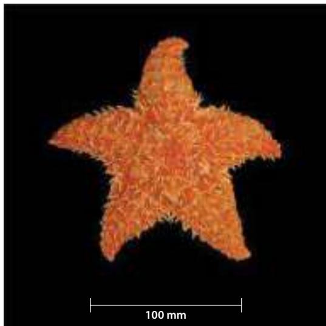

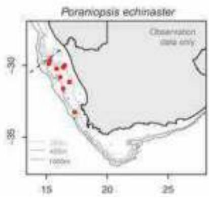

## distinguishing features

Short-armed, stellate body form with a reticular skeleton (spiky skeleton with soft tissue covering). Distinct raised spines covering the aboral surface 1-4 mm in length. Arms fairly rigid, with ends often turning upwards or curling inwards. Two rows of tube feet. Madreporite white in colour, located offcentre halfway to base of arms. Strong spines along the base of arms.

## Colour

Deep orange to red or even pure white, with spines light red to yellowish white. Pale oral surface.

## Size

Average 50 up to 160 mm diameter, mostly small specimens but occasionally large too.

## distribution

South Atlantic including West Coast of South Africa.

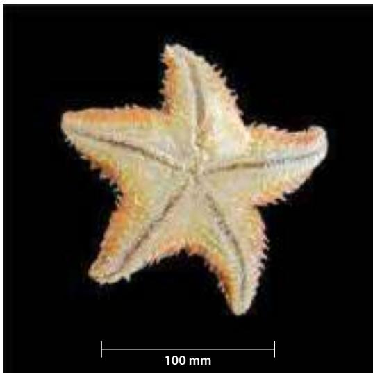

## Similar species

Lophaster quadrispinus, which has many dense raised tubercles on the aboral surface or Diplopteraster multipes, which is more cushion-like, with arms that are not as clearly defined as P. echinaster.

## references

Clark AM and Courtman-Stock J. 1976. The Echinoderms of Southern Africa. British Museum (Natural History): London. p. 90 (277pp.).

Clark AM and Downey ME. 1992. Starfishes of the Atlantic (Volume 3). Chapman and Hall: London. pp. 220-222 (794pp.).

Species identification confirmed by Dr C. Mah, Smithsonian, Washington, June 2015.