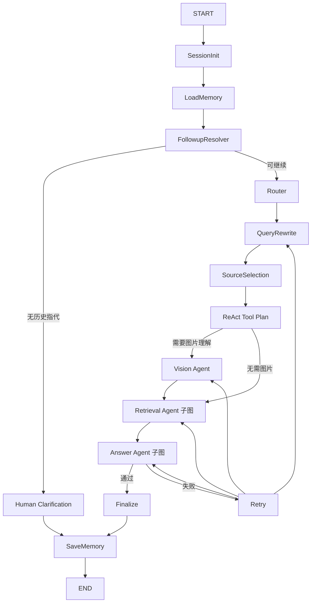

# LangGraph 多轮会话、追问解析与子图设计

## 1. 已解决的问题

旧流程每执行一次 `mrag_cli.py` 都启动一个新 Python 进程，只保存当前
`query/image`。第二轮的“刚才”“它”没有明确实体，因而被当作普通
`text_qa` 在全库检索，可能错误命中虾等其他物种。

当前实现同时使用两层记忆：

- `MemorySaver + thread_id`：同一进程内的 LangGraph checkpoint。
- `data/mrag/sessions/{session_id}.json`：跨 CLI 进程的持久化会话。

会话文件最多保存最近 100 轮，并保存上一轮物种、图片路径、caption、
回答、执行轨迹和警告。不同 `session_id` 完全隔离。

## 2. 文件调用链

```text
mrag_cli.py
  ├── config.py                 路径、模型和检索参数
  ├── conversation.py           JSON 会话读写、原子替换、会话隔离
  ├── models.py                 AquaBioState / RouteDecision
  ├── workflow.py               Supervisor 主图与两个专家子图
  ├── retrieval.py              物种过滤、加权排序
  ├── vector_db.py              BGE-M3 + Chroma
  └── aquabio/openrouter.py      Qwen/OpenRouter 文本与视觉调用
```

## 3. State 关键字段

```text
会话：
session_id, session_initialized, conversation_history, memory_summary

指代解析：
followup_detected, resolved_query, resolved_species_ids
need_clarification, clarification_question

工具执行：
route, selected_tools, tool_plan, tool_observations
detected_species_ids, text/image/multimodal/pdf_context

回答控制：
response_mode, response_constraints, draft_answer
evaluation_result, final_answer, retry_count, trace, warnings
```

`detected_species_ids` 必须声明在 `AquaBioState` 中。LangGraph 只保留
State schema 内的字段；漏掉该字段会导致视觉节点明明识别出 `starfish`，
后续记忆节点却收不到它。

## 4. 主图与子图



检索专家子图：

```text
retrieve -> weighted rerank -> context builder
```

回答专家子图：

```text
answer generation -> response guard -> evaluation
```

主图是 Supervisor；两个编译后的 `StateGraph` 作为主图节点调用，属于
Graph-as-a-Tool/子图组合。Vision、Retrieval、Answer、Evaluation、Memory
各自有清晰职责，形成受控的 Multi-Agent 编排。

## 5. 追问解析规则

当本轮没有新图片，且问题包含“刚才、上次、它、这个生物”等指代时：

1. 从会话 `summary.last_species_ids` 读取上一轮明确物种。
2. 将问题改写为带实体的完整问题。
3. 路由为 `followup_text_qa`。
4. 只选择 `text_retriever`。
5. Chroma 查询加入 `species_id in resolved_species_ids`。
6. 轨迹记录 `filter_species=starfish`。

如果本轮有新图片，“这个生物”指当前图片，不会误用上一轮物种。
如果没有历史可解析，流程进入 `human_in_loop:clarification`，不会盲目检索。

对“只回答常见颜色，要简短”使用 `short_color_only` 输出守卫，最终只保留
颜色词，不附加解释、引用或物种名称。

## 6. 运行命令

先清空示例会话：

```cmd
cd /d F:\rag\AquaBio-AgentRAG
.\.venv\Scripts\python.exe mrag_cli.py clear-session --session starfish_demo
```

第一轮图文问答：

```cmd
.\.venv\Scripts\python.exe mrag_cli.py ask --session starfish_demo --query "这个生物的外貌是什么样子的？" --image "data\mrag\images\starfish\img_starfish_001.jpg"
```

第二轮在另一个 CLI 进程追问：

```cmd
.\.venv\Scripts\python.exe mrag_cli.py ask --session starfish_demo --query "刚才问到的是什么生物，然后只回答它的常见颜色，要简短，不要回答其他内容？"
```

预期第二轮核心轨迹：

```text
session_init:starfish_demo
memory_load:1
followup_resolver:True:starfish:short_color_only
router:followup_text_qa
source_selection:text_retriever
react_tool_plan:text_retriever
retrieval:text=...,image=0,pair=0,pdf=0,filter_species=starfish
rerank:weighted:...
response_guard:short_color_only
evaluation:True:terse
memory_save:1
```

查看、列出和清空会话：

```cmd
.\.venv\Scripts\python.exe mrag_cli.py history --session starfish_demo --json
.\.venv\Scripts\python.exe mrag_cli.py list-sessions
.\.venv\Scripts\python.exe mrag_cli.py clear-session --session starfish_demo
```

不写 `--session` 时使用 `default`，因此用户原来的两条命令也会共享历史。

## 7. 验证

```cmd
.\.venv\Scripts\python.exe -m unittest discover -s tests -v
```

`tests/test_conversation_memory.py` 验证会话持久化、session 隔离、无历史澄清、
当前图片指代，以及两个独立 workflow 实例之间的海星追问解析。
