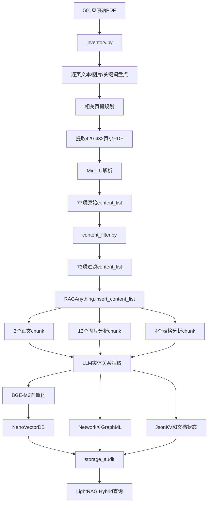

# SA Offshore Marine Invertebrates PDF 逐步处理详解

> 对应原文件：  
> `F:\rag\AquaBio-AgentRAG\data\mrag\pdfs\Field-Guide-to-SA-Offshore-Marine-Invertebrates_web-full-version_compressed.pdf`  
> 审计日期：2026-06-11

## 1. 先说明当前实际处理范围

这份 PDF 一共有 501 页，但当前没有把 501 页全部建立图谱索引。

已经完成：

```text
501 页全书页面盘点
501 页文本密度和图片对象统计
候选物种页面扫描
相关页段和全书页段规划
原 PDF 第 429-432 页真实 MinerU 解析
429-432 页文本、图片、表格处理
429-432 页 LightRAG 实体关系图谱
429-432 页 Hybrid 查询
```

尚未完成：

```text
其余 497 页的 RAG-Anything 索引
整本书全部实体和关系抽取
整本书全部图片 VLM 分析
整本书全部表格入图
整本书统一 Hybrid 查询验收
```

这份 PDF 也没有进入主 Chroma 的 772 条索引。实测文件名在：

```text
data/mrag/knowledge/pdf_chunks.jsonl
data/mrag/knowledge/rag_documents_combined.jsonl
```

中的出现次数均为 0。因此目前它只属于 RAG-Anything/LightRAG 子系统。

## 2. 原 PDF 基本信息

```text
book_id: sa_invertebrates
文件页数: 501
PDF 图片对象: 1477
SHA-256:
8919616a2d374f1e9f9e835a31769f95f4e51043d83b36c86095feee21401718
格式: PDF 1.5
创建工具: Adobe InDesign CS6
生成工具: GPL Ghostscript 9.52
```

盘点记录位于：

```text
data/mrag/raganything/inventory/books.json
```

该记录中的历史 `path` 仍是迁盘前的 C 盘路径，但索引代码运行时会根据当前
项目根目录重新组成 F 盘路径，所以不影响当前运行。

## 3. 文件调用总流程



入口命令：

```cmd
cd /d F:\rag\AquaBio-AgentRAG
.\.venv-raganything\Scripts\python.exe raganything_cli.py inventory
.\.venv-raganything\Scripts\python.exe raganything_cli.py inspect --segment sa_invertebrates_p0429_0432
.\.venv-raganything\Scripts\python.exe raganything_cli.py status
.\.venv-raganything\Scripts\python.exe raganything_cli.py audit-storage
```

## 4. 第一步：扫描整本 PDF

执行：

```cmd
.\.venv-raganything\Scripts\python.exe raganything_cli.py inventory
```

调用链：

```text
raganything_cli.py
  → build_inventory()
  → src/aquabio_raganything/inventory.py
  → fitz.open(PDF)
  → 逐页 page.get_text("text")
  → 逐页 page.get_images(full=True)
```

每一页生成一条记录：

```json
{
  "book_id": "sa_invertebrates",
  "page": 429,
  "page_index": 428,
  "text_chars": 969,
  "image_count": 3,
  "matched_species": ["starfish"],
  "matched_terms": [
    "Asteroidea",
    "Echinodermata",
    "Starfish",
    "starfish"
  ],
  "needs_ocr": false,
  "candidate": true
}
```

输出：

```text
data/mrag/raganything/inventory/page_inventory.jsonl
```

这份书的盘点结果：

```text
总页数: 501
候选页面: 266
低文本密度且含图片的 needs_ocr 页面: 2
相关页段: 23
全量页段: 13
```

这里的 `needs_ocr` 只是盘点标志。AquaBio 没有自己逐页执行 OCR 分支，
后续实际解析交给 MinerU 的 `auto/txt` 和 pipeline backend。

## 5. 第二步：页面如何被判定为候选页

系统读取 20 类物种表：

```text
aquabio_mrag_long_text_database/data/species_list.json
```

为每种生物收集：

```text
english_name
scientific_name
worms_name
wiki_title
英文关键词
```

然后用大小写不敏感的正则表达式扫描每页数字文本。

同时扫描上位分类词：

```text
Echinodermata
Asteroidea
Echinoidea
Holothuroidea
Mollusca
Crustacea
Cnidaria
...
```

要注意：

```text
candidate = 是否命中具体 20 类物种
matched_terms = 具体物种词 + 上位分类词
```

只命中 `Echinodermata` 不会单独让页面成为 candidate。

## 6. 第三步：相关页面如何合并成分段

规则：

1. 相距不超过 3 页的候选页合并。
2. 合并组前后各扩展 1 页。
3. 每段最大 40 页。
4. 相邻长分段重叠 1 页。

该 PDF 得到 23 个相关页段，例如：

```text
p0003_0005
p0011_0025
p0068_0107
p0351_0390
p0390_0429
p0429_0432
p0435_0454
...
```

当前实际索引的是：

```text
segment_id = sa_invertebrates_p0429_0432
doc_id = doc_sa_invertebrates_p0429_0432
```

### 6.1 为什么该分段标签有六类物种

`relevant_ranges.json` 中该段的 `matched_species` 是：

```text
coral
octopus
sea_cucumber
sea_urchin
squid
starfish
```

但 429–431 页实际命中的是 `starfish`，432 页未命中具体 20 类物种。

原因是：

```text
351-432附近候选页先被合并成一个大组
  ↓
大组汇总了六类物种
  ↓
大组按最多40页切分
  ↓
每个子段继承大组的物种集合
```

所以 `matched_species` 是“候选大组标签”，不是“该四页的逐页精确物种标签”。
检索或评估时不能把这六类直接当成四页正文事实。

## 7. 第四步：提取四页小 PDF

调用：

```python
extract_segment_pdf(paths, segment)
```

PyMuPDF 执行：

```python
output.insert_pdf(
    source,
    from_page=428,
    to_page=431,
)
```

生成：

```text
data/mrag/raganything/segment_pdfs/
└── sa_invertebrates/
    └── sa_invertebrates_p0429_0432.pdf
```

小 PDF：

```text
页数: 4
文件大小: 114606 bytes
```

已验证小 PDF 四页文本与原 PDF 的物理 429–432 页逐页完全相同。

### 7.1 PDF 页码与印刷页码

系统使用 PDF 物理页序号：

| PDF 物理页 | 页面印刷页码 |
|---:|---:|
| 429 | 426 |
| 430 | 427 |
| 431 | 428 |
| 432 | 429 |

因此证据中的 `[PAGE=429]` 表示 PyMuPDF 的第 429 个 PDF 页面。
人工打开书查看时，页面版心可能显示 426。

使用物理页码的原因是：

```python
pdf.load_page(page_number - 1)
```

能够稳定、无歧义地定位原始 PDF。

## 8. 第五步：这四页原本是什么内容

四页主要是海星物种卡：

| PDF物理页 | 表格物种 | 常用名 |
|---:|---|---|
| 429 | `Luidia sarsii africana` | Legs break easily starfish |
| 430 | `Chondraster elattosis` | Pentagon star |
| 431 | `Spoladaster veneris` | Inflated star |
| 432 | `Poraniopsis echinaster` | Spiky cushion star |

每页通常包含：

```text
分类表
物种图片
distinguishing features
colour
size
distribution
similar species
references
```

例如 PDF 物理页 429 中的正文事实：

```text
腕很容易从中央盘脱落
反口面边缘有明显棘刺
腕长、柔软、扁平、逐渐变细，呈带状
通常五条腕
颜色棕色至深粉色
平均直径可达150 mm
南非南部特有
分布于南非西海岸和南海岸至Port Elizabeth
深度54 m至360 m以上
```

## 9. 第六步：MinerU 解析

配置：

```text
parser = mineru
parse_method = auto
parser_backend = pipeline
language = en
```

正常入口：

```python
rag.parse_document(
    file_path=segment_pdf,
    output_dir=parser_dir,
    parse_method="auto",
    backend="pipeline",
    lang="en",
)
```

Windows 下实现了恢复路径：

1. RAG-Anything 内部 MinerU 调用。
2. 如果失败，搜索已生成的 `*_content_list.json`。
3. 仍没有完整结果，则直接调用 `mineru` CLI。
4. 保存 `mineru_windows.log`。

本段历史上经历了多次失败：

```text
attempt 1: 找不到 mineru 命令
attempt 3: MinerU CLI 执行失败
attempt 5: RAG-Anything 初始化时未识别 MinerU
attempt 6: 首次标记 fully_processed，但仅有3个正文chunk
attempt 7: 完整多模态重建，最终20个chunk并通过存储审计
```

最终使用的解析产物位于：

```text
data/mrag/raganything/parser_output/
└── sa_invertebrates/
    └── sa_invertebrates_p0429_0432/
        ├── filtered_content_list.json
        └── windows_cli_recovery/
            └── sa_invertebrates_p0429_0432/
                └── txt/
                    ├── images/
                    ├── sa_invertebrates_p0429_0432.md
                    ├── ..._content_list.json
                    ├── ..._middle.json
                    ├── ..._model.json
                    ├── ..._layout.pdf
                    └── ..._span.pdf
```

## 10. 第七步：MinerU 原始 content_list

原始 `content_list` 共 77 项：

| 类型 | 数量 |
|---|---:|
| text | 52 |
| header | 4 |
| page_number | 4 |
| image | 9 |
| chart | 4 |
| table | 4 |
| 合计 | 77 |

每项还包含：

```text
page_idx
bbox
text/table_body
img_path
caption/footnote
```

这里的 `chart` 主要是 MinerU 对页面中某类图像区域的版面分类结果，
项目随后统一按 image 处理。

## 11. 第八步：过滤和标准化 content_list

调用：

```python
prepare_content_list(...)
```

处理规则：

```text
4个 page_number        删除
4个 header             转为 text
4个 chart              转为 image
空文本                  删除
图片文件不存在          删除
宽或高小于256px图片     删除
同一分段SHA-256重复图   删除
局部分段页码            转为原PDF全局页码
文本增加来源标记
图片/表格footnote增加来源标记
```

本段没有图片因尺寸、重复或文件缺失被拒绝：

```text
rejected_images = 0
dropped_metadata = 4个page_number
```

最终 73 项：

| 类型 | 数量 |
|---|---:|
| text | 56 |
| image | 13 |
| table | 4 |
| 合计 | 73 |

转换关系：

```text
52 text + 4 header = 56 text
9 image + 4 chart = 13 image
4 table = 4 table
4 page_number 被删除
```

### 11.1 每页过滤后内容

| PDF物理页 | text | image | table |
|---:|---:|---:|---:|
| 429 | 13 | 3 | 1 |
| 430 | 15 | 4 | 1 |
| 431 | 13 | 3 | 1 |
| 432 | 15 | 3 | 1 |

### 11.2 来源标记

每个正文块前增加：

```text
[DOC_ID=doc_sa_invertebrates_p0429_0432]
[SOURCE=Field-Guide-to-SA-Offshore-Marine-Invertebrates_web-full-version_compressed.pdf]
[PAGE=429]
```

实际存储时三个标签位于同一行：

```text
[DOC_ID=...][SOURCE=...][PAGE=429]
Arms usually break off central disc very easily...
```

图片和表格则记录：

```text
doc_id=doc_sa_invertebrates_p0429_0432;
page=429;
source=Field-Guide-to-SA-Offshore-Marine-Invertebrates_web-full-version_compressed.pdf
```

## 12. 第九步：精确文本定位审计

执行：

```cmd
.\.venv-raganything\Scripts\python.exe raganything_cli.py inspect --segment sa_invertebrates_p0429_0432
```

`audit.py` 对每个 text block：

1. 根据 `page_idx` 打开原 PDF 物理页。
2. 检查 `DOC_ID/SOURCE/PAGE`。
3. 去掉 provenance。
4. 归一化空格和断词。
5. 检查正文是否存在于原页文本。

实测：

```text
第429页: 13/13
第430页: 15/15
第431页: 13/13
第432页: 15/15
总计: 56/56
exact_match_rate = 1.0
missing_images = 0
valid = true
```

这里验证的是“文本可回到原 PDF 页”，不是对 MinerU 表格结构或图片视觉描述正确率
进行人工标注评测。

## 13. 第十步：图片具体做了什么

13 张过滤后图片尺寸均大于 256 px，例如：

```text
429页: 409x387, 540x537, 537x537
430页: 409x387, 359x354, 353x354, 356x354
431页: 412x387, 540x537, 537x537
432页: 537x537, 412x390, 537x537
```

原始 MinerU caption 均为空，因此 RAG-Anything 主要使用：

```text
图片像素
页面上下文
相邻正文
section path
页码和来源
```

生成 `Image Content Analysis`。

运行时配置：

```text
优先 VLM: Gemini
gemini-2.5-flash
fallback: gemini-2.5-flash-lite
如果没有Gemini key: 回退到文本LLM函数
```

之后 LLM 从图片分析文本和邻近正文抽取：

```text
image entity
物种/分类 entity
形态 entity
document/page/section entity
depicts/description/belongs_to 等 relation
```

需要准确说明：

```text
这些图片形成了13个图片分析chunk
图谱中存在image实体和跨模态关系
但没有独立人工标注验证每张图片的VLM识别是否正确
```

因此不能把它描述为经过检测数据集验证的视觉识别。

## 14. 第十一步：表格具体做了什么

四个表格是分类表：

```text
429 Luidia sarsii africana
430 Chondraster elattosis
431 Spoladaster veneris
432 Poraniopsis echinaster
```

MinerU 将它们恢复为 HTML：

```html
<table>
  <tr><td>Phylum:</td><td>Echinodermata</td></tr>
  <tr><td>Class:</td><td>Asteroidea</td></tr>
  ...
</table>
```

RAG-Anything 的 Table Processor 生成表格语义描述，再抽取：

```text
table实体
species实体
phylum/class/order/family/genus实体
分类关系
belongs_to跨模态关系
```

真实图中存在：

```text
Luidia sarsii africana taxonomic classification table
  → Echinodermata
  → Asteroidea
  → Paxillosida
  → Luidiidae
  → Luidia
  → Luidia sarsii africana
```

## 15. 第十二步：插入 RAG-Anything

调用：

```python
await rag.insert_content_list(
    content_list=prepared,
    file_path=segment["source_file"],
    doc_id=segment["doc_id"],
    display_stats=True,
)
```

这里不是项目自己仿写图谱抽取，而是调用：

```text
F:\rag\RAG-Anything-main\RAG-Anything-main
```

中的 RAG-Anything 和 LightRAG 实现。

运行参数：

```text
enable_image_processing = true
enable_table_processing = true
enable_equation_processing = true
context_window = 1
context_mode = page
max_context_tokens = 2000
include_headers = true
include_captions = true
max_concurrent_files = 1
```

低并发是为了降低 API 限流和中途失败风险。

## 16. 第十三步：73 个内容项如何变成 20 个 chunk

LightRAG 最终不是保存 73 个独立向量，而是形成：

| chunk 类型 | 数量 |
|---|---:|
| 合并正文 chunk | 3 |
| 图片分析 chunk | 13 |
| 表格分析 chunk | 4 |
| 合计 | 20 |

正文 56 个小块被按 token 合并为三个大块：

```text
chunk 1: 1200 tokens
chunk 2: 1200 tokens
chunk 3: 1056 tokens
```

其中 chunk 边界不保证与单页一致。例如第二个正文 chunk 从第 430 页中间开始，
第三个 chunk 从第 431 页内容延续到第 432 页。

每个图片和表格独立形成一个多模态分析 chunk，所以：

```text
3 + 13 + 4 = 20
```

## 17. 第十四步：实体和关系如何生成

当前文本图谱抽取模型配置为：

```text
provider: deepseek
model: deepseek-v4-flash
```

领域实体类型：

```text
species
taxon
anatomical_feature
habitat
behavior
distribution
conservation_status
image
table
equation
document
section
```

提示模型重点抽取：

```text
is_a
has_feature
lives_in
distributed_in
exhibits_behavior
similar_to
distinguished_from
illustrated_by
listed_in
described_in
part_of
belongs_to
associated_with
```

### 17.1 Luidia 的真实实体

实体：

```text
Luidia Africana
```

实体描述汇总了：

```text
腕容易从中央盘脱落
反口边缘有明显棘刺
长、柔软、扁平、带状腕
通常五腕
棕色至深粉色
直径约150 mm
南部非洲特有
西海岸和南海岸至Port Elizabeth
54 m至360+ m
```

来源：

```text
正文chunk:
chunk-c93021c72fb2fa03f2a5d62bc0adb874

表格chunk:
chunk-f0f7451703f2287af83a619489c9a745
```

### 17.2 真实关系示例

```text
Luidia Africana --has feature--> Arms
Luidia Africana --has feature--> Central Disc
Luidia Africana --has feature--> Aboral Margin Edge
Luidia Africana --classified as--> Echinodermata
Luidia Africana --distributed in--> West Coast Of South Africa
Luidia Africana --distributed in--> South Coast Of South Africa
Luidia Africana --located on--> Page 429
Luidia Africana --similar to--> Astropecten Polyacanthus
Luidia Africana --similar to--> Astropecten Exilis
```

关系的 `source_id` 指回对应 chunk，因此可以从图边回到正文或表格。

### 17.3 图谱噪声

当前实体合并并不完美，例如可能同时出现：

```text
Luidia Africana
Luidia Sarsii Africana
Field Guide to SA Offshore Marine Invertebrates
Field Guide To Sa Offshore Marine Invertebrates
```

还可能将跨页邻近文本与图片关联得过宽。这说明图谱是真实生成的，但仍需要：

```text
canonical entity normalization
同义词合并
关系类型标准化
图片-正文版面绑定优化
人工抽样评估
```

## 18. 第十五步：BGE-M3 如何形成向量库

Embedding：

```text
BAAI/bge-m3
维度: 1024
normalize_embeddings = true
metric = cosine
```

三类内容分别编码：

```text
20个chunk文本
192个实体名称+描述
542条关系两端实体+关系描述
```

输出：

```text
data/mrag/raganything/working/
├── vdb_chunks.json          20
├── vdb_entities.json        192
└── vdb_relationships.json   542
```

NanoVectorDB JSON 中不仅有 metadata，还保存压缩/序列化后的向量矩阵。

## 19. 第十六步：图和元数据如何持久化

工作目录：

```text
data/mrag/raganything/working/
```

文件职责：

| 文件 | 内容 |
|---|---|
| `kv_store_full_docs.json` | 合并后的原始文档 |
| `kv_store_text_chunks.json` | 20 个 chunk |
| `kv_store_full_entities.json` | 该 doc_id 的实体名称集合 |
| `kv_store_full_relations.json` | 该 doc_id 的关系对 |
| `kv_store_entity_chunks.json` | 实体到来源 chunk |
| `kv_store_relation_chunks.json` | 关系到来源 chunk |
| `vdb_chunks.json` | chunk 向量 |
| `vdb_entities.json` | 实体向量 |
| `vdb_relationships.json` | 关系向量 |
| `graph_chunk_entity_relation.graphml` | NetworkX 图 |
| `kv_store_doc_status.json` | 文档处理状态 |
| `kv_store_llm_response_cache.json` | LLM 调用缓存 |

最终状态：

```text
chunks: 20
entities: 192
relationships: 542
graph_nodes: 192
graph_edges: 542
doc_status: processed
multimodal_processed: true
```

## 20. 第十七步：为什么判定 fully_processed

项目不只相信 RAG-Anything 的状态字段，而是执行独立审计：

```text
document_status 存在
chunk vector store 非空
text chunk store 非空
entity vector store 非空
relationship vector store 非空
NetworkX 图有节点和边
full entity metadata 非空
full relation metadata 非空
```

当前八项全部为 true：

```text
storage_valid = true
storage_missing = []
```

这是因为历史上第六次处理曾出现：

```text
状态看似 fully_processed
但只有3个正文chunk
```

第七次重新处理后才得到完整的 20 个多模态 chunk 和 192/542 图谱。

## 21. 第十八步：Hybrid 查询如何使用这些数据

执行：

```cmd
.\.venv-raganything\Scripts\python.exe raganything_cli.py query --mode hybrid --query "Luidia sarsii africana 的识别特征、颜色、尺寸和分布是什么？" --top-k 6
```

调用：

```python
rag.aquery(
    query,
    mode="hybrid",
    only_need_context=True,
    top_k=6,
    chunk_top_k=6,
    vlm_enhanced=False,
)
```

查询过程：

```text
问题
  ↓
LLM提取关键词
  ↓
实体向量检索 local
  +
关系向量检索 global
  +
实体/关系关联chunk
  +
NetworkX图关系上下文
  ↓
去重和token截断
  ↓
返回实体、关系、chunk上下文
  ↓
query_adapter解析PAGE/DOC_ID/SOURCE
  ↓
形成evidence
```

本次查询日志：

```text
local: 6 entities, 31 relations
global: 8 entities, 6 relations
合并后: 14 entities, 37 relations
最终上下文: 14 entities, 37 relations, 6 chunks
```

返回的关键事实包括：

```text
腕长、柔软、扁平、逐渐变细
腕容易脱落
反口面边缘有明显棘刺
棕色至深粉色
平均直径约150 mm
南非西海岸和南海岸至Port Elizabeth
深度54 m至360 m以上
```

## 22. 当前 Hybrid 查询的已知问题

### 22.1 `chunks` 结构化字段为空

`query_adapter.py` 当前返回：

```json
{
  "entities": [...],
  "relations": [...],
  "chunks": [],
  "evidence": [...]
}
```

LightRAG 内部实际选出了 6 个 chunks，但适配层没有直接把结构化 chunk 列表填入
`chunks`，而是从拼接后的 `raw_context` 再解析 evidence。

### 22.2 evidence 页码可能混入邻近结果

查询 Luidia 时，LightRAG 可能同时返回第 432 页的 Poraniopsis 图片/关系上下文。
原因是：

```text
四个物种共享Echinodermata/Asteroidea等实体
图片使用相邻正文
图关系会扩展共享分类节点
```

最终回答时需要优先选择明确包含 `Luidia` 和 `[PAGE=429]` 的证据。

### 22.3 未配置独立 reranker

运行日志显示：

```text
Rerank is enabled but no rerank model is configured
```

所以当前没有 Cross-Encoder/BGE-Reranker 二次精排。

### 22.4 CPU embedding 超时

本次查询出现一次：

```text
Embedding worker timeout after 60s
```

LightRAG 随后仍通过实体、关系和关联 chunk 完成了查询，但这说明 CPU 冷启动和
超时参数需要优化。

### 22.5 VLM-enhanced query 未开启

查询固定使用：

```text
vlm_enhanced = false
```

当前只是文本问题查询图文索引，不会在查询阶段再次把检索图片发送给 VLM。

## 23. 当前这份 PDF 的真实状态总结

```text
整本501页:
  已盘点
  已规划23个相关分段和13个全量分段
  未全部索引

429-432页:
  已提取为4页小PDF
  已经MinerU解析
  56个文本块全部准确回到原页
  已保留13张图片
  已恢复4个分类表
  已形成3个正文chunk
  已形成13个图片chunk
  已形成4个表格chunk
  已生成192个实体
  已生成542条关系
  已生成NetworkX图
  已生成三类BGE-M3向量
  已通过持久化审计
  已可进行LightRAG Hybrid查询
```

最准确的一句话是：

> 这份 501 页 PDF 已完成全书页面盘点，但目前只对物理页 429–432 做了真实的
> RAG-Anything 多模态图谱索引；该四页已从 PDF 文本、图片和分类表生成
> LightRAG chunk、实体、关系、BGE-M3 向量和 NetworkX 图，并能进行 Hybrid 查询。
