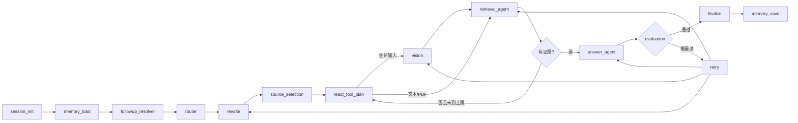

# 产品化界面与 Agent 工具流程

## 1. 本轮界面升级

聊天界面由普通 Streamlit 表单升级为 Agent 工作台：

- 深色海洋主题侧栏、可滚动会话列表、搜索、收藏和逐会话重命名。
- 顶部状态卡展示后端、图谱规模、当前模型和运行模式。
- 四种运行模式：标准 Agent、快速文本 RAG、图谱研究、图像识别。
- 图片和 PDF 分栏上传，明确说明临时 PDF 不自动写入长期索引。
- 快捷任务按钮用于图片识别、生态问答、PDF 页码查询和相似物种比较。
- 每轮只展示一张最佳图片，优先级为 PDF 原图、本地图库、网络图片。
- Agent 驾驶舱展示 ReAct 阶段、LangGraph 事件、MCP 活动和证据来源。
- 用户可对每轮回答评价“有帮助、一般、需改进”，反馈写入 SQLite。

### 分布图严格检索

用户明确请求“分布图”时，图片角色被固定为
`distribution_map`，普通物种照片、栖息环境照片和 specimen 不允许替代。

检索顺序：

```text
用户请求分布图
  ↓
RAG-Anything MCP 查询 PDF 图片实体
  ↓
命中 distribution_map
  ├─ 是：返回 PDF 原图、PDF 页码和实体 caption
  └─ 否：查询 Wikimedia Commons
          ↓
        校验文件标题和描述：
        同时包含目标物种 + distribution/range/map
          ↓
        下载、缓存并显示经过校验的地图
```

对于仅识别到“鲨鱼”等上位类群的情况，网络结果可能对应大白鲨、虎鲨等
具体物种。回答必须显示具体地图标题，并说明该图不代表整个上位类群。

## 2. ReAct 与 React 的区别

本项目实现的是 **ReAct Agent 模式**，不是 React.js 前端框架。

```text
Thought
  路由、追问解析、查询改写、工具规划
    ↓
Action
  VLM、Chroma、BM25、LightRAG MCP、PDF 图片 MCP、Web API
    ↓
Observation
  RRF 融合、去重、重排、上下文构建
    ↓
Answer
  Qwen 生成、响应约束、自动评估、重试、保存记忆
```

`MRAG_REACT_NATIVE=true` 时，Qwen 通过原生 function calling 在允许的工具中
做受控选择。模型选择失败时，系统降级到确定性路由，不会让整个问答失败。

## 3. LangGraph 主流程



`retrieval_agent` 是检索子图：`retrieve → rerank → build_context`。

`answer_agent` 是生成子图：`generate → guard → evaluate`。

## 4. MCP 调用链

```text
workflow.retrieval_node
  → RetrievalAgent.search_pdf / search_pdf_images
    → project_mcp_client
      ├─ chroma MCP（stdio）
      └─ raganything MCP（streamable HTTP，127.0.0.1:8765/mcp）
          ├─ raganything_hybrid_search
          ├─ raganything_graph_neighbors
          ├─ raganything_image_search
          ├─ raganything_entity_images
          ├─ raganything_source_detail
          └─ raganything_index_status
```

MCP 返回失败时，PDF 文本检索降级到 Chroma + BM25；警告会进入答案结果，
已有索引不会被破坏。

## 5. 驾驶舱数据来源

界面不展示伪造的“思考过程”。所有状态来自：

- `result.trace`：LangGraph 节点和工具执行事件。
- `result.evidence`：检索证据和来源元数据。
- `/api/system/status`：模型、向量库、图谱和 warmup 状态。
- `/api/mcp/tools`：MCP Server 实际发现的工具。

模型私有思维链不会保存或展示。
