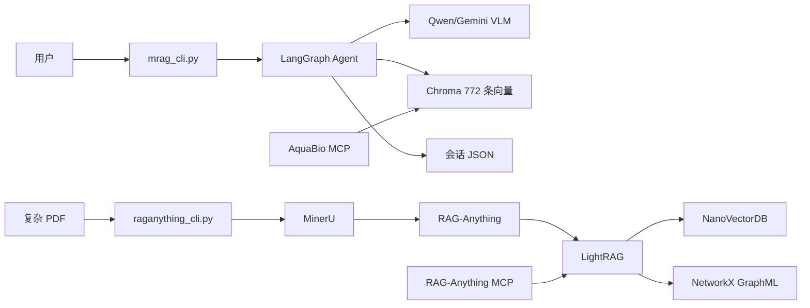
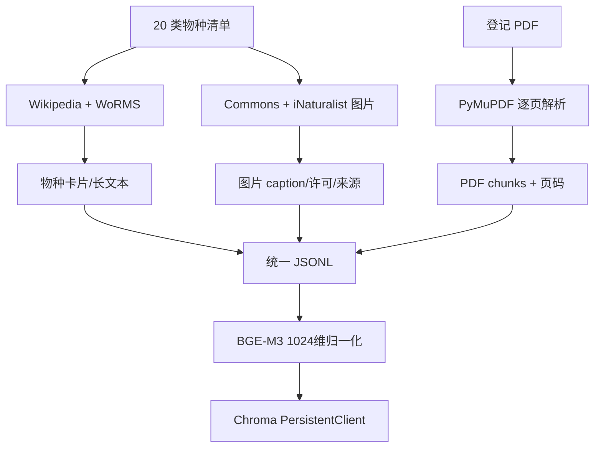
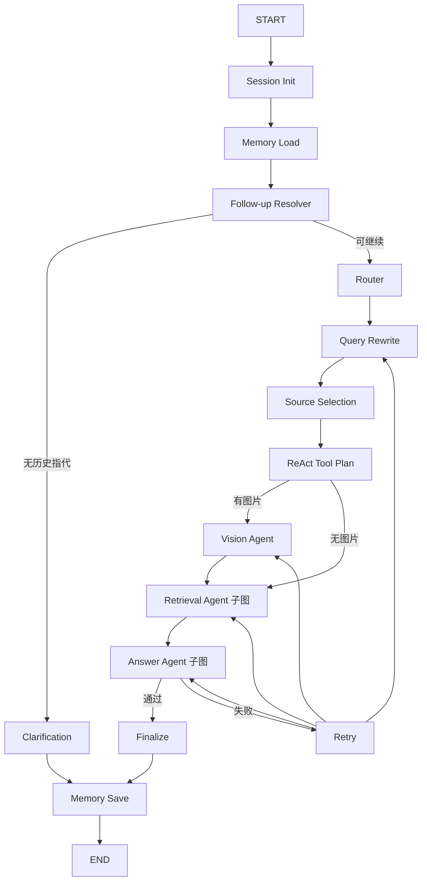

# AquaBio-AgentRAG 项目全流程、技术架构与实现审计

> 2026-06-11 实现更新：本文后半部分关于“主图没有 MCP Client、没有 BM25、
> ReAct 只是固定列表、HITL 不可恢复”的判断是改造前审计结论。当前代码已经新增
> `mcp_client.py`、`retrieval_agent.py`、`react_agent.py`、SQLite checkpoint 和
> `interrupt/resume`。南非指南也已完成 409 条目录、409 个页面单元、3871 个
> RAG chunk、1091 个图片对象和 6241 条基础关系的确定性抽取。最新的逐页事实、
> 命令和边界以 `docs/南非海洋无脊椎动物PDF逐步处理流程.md` 为准。

> 审计日期：2026-06-11  
> 项目目录：`F:\rag\AquaBio-AgentRAG`  
> 本文依据当前源码、命令实测和持久化文件编写，不把设计目标当成已实现功能。

## 1. 项目定位

AquaBio-AgentRAG 是一个面向水下生物知识问答和图像理解的实验型
Agentic Multimodal RAG 项目。当前同时存在两套知识索引：

1. **AquaBio-MRAG 主系统**：BGE-M3 + Chroma + LangGraph。
2. **RAG-Anything PDF 图谱子系统**：MinerU + RAG-Anything + LightRAG。

两套系统都能独立运行，但目前还没有在一个 LangGraph 请求中融合。



## 2. 当前真实数据与存储

### 2.1 Chroma 主知识库

2026-06-11 实测：

| 内容 | 数量 |
|---|---:|
| 物种类别 | 20 |
| 物种卡片 | 20 |
| 物种长文本块 | 160 |
| 图片 caption 文档 | 200 |
| 图片-文本配对 | 200 |
| PDF 文本块 | 192 |
| Chroma 向量 | 772 |

持久化位置：

```text
data/mrag/vector_db/chroma/
├── chroma.sqlite3
├── 3d8.../
└── mrag_manifest.json
```

注意：`mrag_manifest.json` 中的 `document_file` 仍记录迁盘前的 C 盘路径。
当前 Chroma 查询不依赖该字段，因此不影响运行，但下次重建索引时应刷新清单。

### 2.2 LightRAG 图谱索引

当前不是两本 PDF 全量索引，而是一个真实的四页验收段：

```text
Field-Guide-to-SA-Offshore-Marine-Invertebrates...
原 PDF 第 429-432 页
doc_id = doc_sa_invertebrates_p0429_0432
```

2026-06-11 实测：

| 存储对象 | 数量 |
|---|---:|
| LightRAG chunks | 20 |
| 实体向量 | 192 |
| 关系向量 | 542 |
| NetworkX 节点 | 192 |
| NetworkX 边 | 542 |
| 已完成分段 | 1 |

`audit-storage` 的八个要求全部通过，说明这不是空目录或模拟输出。

## 3. 项目模块结构

```text
AquaBio-AgentRAG/
├── mrag_cli.py                         Chroma + LangGraph 主入口
├── raganything_cli.py                  PDF 图谱入口
├── app.py                              Streamlit 入口，非当前主要验收入口
├── scripts/
│   ├── 01_crawl_wikipedia_worms.py     文本和分类来源
│   ├── 02_crawl_commons_images.py      Commons 图片
│   ├── 02b_fill_inaturalist_images.py  iNaturalist 补充图片
│   ├── 03_build_multimodal_documents.py 统一文档
│   ├── 04_download_parse_pdfs.py       普通 PDF 文本解析
│   └── 05_build_chroma_bge.py          Chroma 建库
├── src/aquabio_mrag/
│   ├── models.py                       State 和数据模型
│   ├── config.py                       路径与参数
│   ├── data_pipeline.py                文本、图片、配对构建
│   ├── pdf_pipeline.py                 PyMuPDF PDF 管线
│   ├── vector_db.py                    BGE-M3 + Chroma
│   ├── retrieval.py                    检索、过滤和加权排序
│   ├── workflow.py                     LangGraph 主图和子图
│   ├── conversation.py                 会话持久化
│   └── mcp_server.py                   Chroma MCP Server
├── src/aquabio_raganything/
│   ├── inventory.py                    PDF 页面盘点和分段
│   ├── content_filter.py               多模态内容过滤
│   ├── indexer.py                      RAG-Anything 索引流程
│   ├── runtime.py                      LightRAG/VLM/Embedding 配置
│   ├── query_adapter.py                Hybrid 查询和证据适配
│   ├── storage_audit.py                持久化硬验收
│   └── mcp_server.py                   图检索 MCP Server
└── data/mrag/
    ├── images/
    ├── knowledge/
    ├── pdfs/
    ├── vector_db/chroma/
    ├── raganything/
    └── sessions/
```

## 4. 离线数据构建总流程



### 4.1 物种文本

物种清单位于：

```text
aquabio_mrag_long_text_database/data/species_list.json
```

系统使用 Wikipedia 和 WoRMS 数据生成物种概述、分类、形态、栖息地、
行为、相似物种和识别提示等字段，形成：

```text
species_cards.jsonl
species_text_docs.jsonl
```

### 4.2 图片

图片主要来自 Wikimedia Commons 和 iNaturalist。系统保存：

```text
本地文件路径
物种 ID
caption
视觉关键词
原图 URL
来源页面
作者
许可证
```

当前 Chroma 系统没有使用 CLIP 或其他像素 embedding。图片进入索引的方式是：

```text
图片元数据/caption/视觉关键词
  ↓
组成 embedding_text
  ↓
BGE-M3 文本向量
```

因此它是“图片语义文本化检索”，不是原生视觉向量检索。

### 4.3 统一文档

统一文件：

```text
data/mrag/knowledge/rag_documents_combined.jsonl
```

每条记录具有：

```text
id
source_type
species_id
modality
content
embedding_text
metadata
```

这使不同来源能够进入同一个 Chroma collection。

## 5. 普通 PDF 到 Chroma 的完整流程

这条管线由 `src/aquabio_mrag/pdf_pipeline.py` 实现，适合数字文本较完整、
版面要求不复杂的 PDF。

### 5.1 下载与登记

`configs/pdf_sources.json` 定义：

```text
doc_id
title
source_org
doc_type
language
local_path
source_url
usage
priority
```

下载时执行：

1. 检查已有文件是否以 `%PDF` 开头。
2. 使用带重试的 HTTP Session 下载。
3. 校验响应确实为 PDF。
4. 计算文件大小和 SHA-256。
5. 写入 `pdf_registry.jsonl`。

### 5.2 逐页提取

PyMuPDF 对每一页调用：

```python
page.get_text("text")
```

随后执行：

1. 合并英文行末断词。
2. 归一化空格和多余换行。
3. 从前八行推测章节名。
4. 用物种英文名、学名和关键词标记相关物种。

### 5.3 分块

当前使用字符窗口：

```text
chunk size = 1800 字符
overlap = 250 字符
```

优先在空行、句号或分号处截断。每个块保存：

```text
doc_id / doc_title / doc_type
source_org / source_url
page / section / chunk_type
related_species
```

局限是字符长度不等于模型 token，复杂双栏版面也可能出现阅读顺序错误。

### 5.4 PDF 图片

代码支持 `extract_figures=True`，会用 `page.get_images()` 提取内嵌图像，
并用该页前 600 字符作为附近文本。

但当前真实 Chroma 清单为：

```text
pdf_chunk = 192
pdf_figure = 0
```

所以“PDF 图片进入 Chroma”只是代码能力，目前没有形成真实 `pdf_figure` 索引。

### 5.5 PDF chunk 进入向量库

每个 PDF 块将以下内容拼为 `embedding_text`：

```text
文档标题
机构
文档类型
章节
chunk 类型
相关物种
正文
```

随后：

```text
embedding_text
  ↓
BAAI/bge-m3
  ↓
1024维归一化向量
  ↓
Chroma cosine HNSW collection
```

Chroma 保存向量、正文和标量 metadata。查询时用同一个 BGE-M3 编码问题，
根据 cosine distance 召回。

## 6. 复杂 PDF 到 RAG-Anything/LightRAG 的完整流程

这条管线处理两本 422/501 页的水下生物图鉴，目标是保留文本、图片、表格、
页码以及实体关系。

### 6.1 页面盘点

`inventory.py` 使用 PyMuPDF 对 923 页逐页记录：

```text
page/page_index
text_chars
image_count
matched_species
matched_terms
needs_ocr
candidate
```

实测：

| PDF | 页数 | 图像对象 |
|---|---:|---:|
| FIELD IDENTIFICATION GUIDE TO THE LIVING | 422 | 1959 |
| SA Offshore Marine Invertebrates | 501 | 1477 |

低文本密度且有图片的页面标为 `needs_ocr`。当前代码记录该标记，但没有自己实现
逐页 OCR 调度；实际 OCR/版面识别由 MinerU 的解析策略承担。

### 6.2 候选页分段

页面命中物种英文名、学名或关键词后：

1. 相距不超过 3 页的候选合并。
2. 前后各扩展 1 页。
3. 超过最大页数时切段。
4. 相邻段保留重叠页。
5. 生成稳定 `segment_id` 和 `doc_id`。

```text
segment_id = sa_invertebrates_p0429_0432
doc_id = doc_sa_invertebrates_p0429_0432
```

### 6.3 提取分段 PDF

`extract_segment_pdf()` 从原书复制指定页到小 PDF，避免一次处理数百页导致：

```text
MinerU 内存过高
LLM 调用数量过大
免费 API 限流后难以恢复
失败后必须整本重跑
```

### 6.4 MinerU 解析

索引器优先调用：

```python
RAGAnything.parse_document(...)
```

Windows 下如果 Python 调用失败，则尝试读取已有 `content_list`，仍不存在时调用
`mineru` CLI。输出包括：

```text
text
image
table
equation
page_idx
bbox
图片文件
Markdown
content_list.json
```

### 6.5 内容过滤和来源标记

`content_filter.py` 执行：

```text
删除 page_number
header 转 text
chart 转 image
过滤空文本
过滤宽或高不足 256 px 的图片
SHA-256 去除同一分段重复图片
验证图片文件存在
校正分段页码为原 PDF 全局页码
```

文本被改写为：

```text
[DOC_ID=...][SOURCE=...][PAGE=429]
原始正文
```

图片和表格则在 footnote 中写入相同 provenance。

注意：设计中提到感知哈希 pHash，但当前源码实际使用的是 **SHA-256 精确去重**，
不能去除压缩、裁切或缩放后的近似重复图片。

### 6.6 RAG-Anything 插入

过滤后的 `content_list` 直接传入：

```python
rag.insert_content_list(...)
```

不是 AquaBio 自行模仿实体图谱，而是调用本地安装的 RAG-Anything。

处理分为：

```text
文本正文
  → LightRAG chunk
  → LLM 抽取 Entity / Relation

图片
  → ImageModalProcessor
  → VLM 生成描述
  → LLM 从描述抽取 Entity / Relation

表格
  → TableModalProcessor
  → 结构语义描述
  → LLM 抽取 Entity / Relation
```

领域实体类型通过 `addon_params` 注入：

```text
species, taxon, anatomical_feature, habitat, behavior,
distribution, conservation_status, image, table,
equation, document, section
```

### 6.7 Embedding 和 LightRAG 存储

文本、chunk、实体和关系都由本地 BGE-M3 归一化编码。持久化后形成：

```text
JsonKVStorage
├── full docs
├── text chunks
├── entity metadata
├── relation metadata
└── document status

NanoVectorDBStorage
├── chunk vectors
├── entity vectors
└── relationship vectors

NetworkXStorage
└── graph_chunk_entity_relation.graphml
```

当前没有使用 Neo4j。项目过去也没有 Neo4j，因此不是从 Neo4j 降级。
NetworkX 适合当前 192 节点的小型单机图谱。

### 6.8 Hybrid 检索

`rag.aquery(mode="hybrid")` 同时使用：

```text
local：实体相关检索
global：关系相关检索
chunk：原始文本块检索
graph：NetworkX 关系上下文
```

`query_adapter.py` 将 LightRAG 返回的上下文解析成：

```text
entities
relations
evidence
doc_id
source_file
page
relation_path
```

这里的 `chunks` 返回字段当前仍为空列表，证据主要从 LightRAG 拼接后的
`raw_context` 中再次解析，不是直接读取结构化 chunk 查询结果。

## 7. 在线 LangGraph 流程

### 7.1 是否真的实现 LangGraph

**是，真实实现。**

证据：

```python
from langgraph.graph import StateGraph, START, END
from langgraph.checkpoint.memory import MemorySaver
```

`workflow.py` 创建并编译了三个真实 `StateGraph`：

1. Supervisor 主图。
2. Retrieval Agent 子图。
3. Answer Agent 子图。

CLI 的 `ask` 最终调用：

```python
self.graph.invoke(
    initial,
    config={"configurable": {"thread_id": session_id}},
)
```

### 7.2 主图



### 7.3 State 和会话

State 保存：

```text
session_id
conversation_history
memory_summary
resolved_query
resolved_species_ids
image_caption
detected_species_ids
route
selected_tools
四类 context
answer/evaluation/retry/trace
```

记忆分两层：

```text
MemorySaver + thread_id       同进程 checkpoint
data/mrag/sessions/*.json     跨 CLI 进程持久化
```

因此“刚才问到的生物”“它的颜色”能在第二次启动 CLI 时解析回上一轮海星。

### 7.4 ReAct、Graph-as-a-Tool 和 Multi-Agent 的准确评价

| 名称 | 当前实现程度 | 说明 |
|---|---|---|
| State/Node/Edge | 真实实现 | 使用 LangGraph API |
| 条件边和重试 | 真实实现 | evaluation 决定回退节点 |
| Graph-as-a-Tool | 基本实现 | 编译子图作为主图节点 |
| Multi-Agent | 轻量实现 | Supervisor + Vision/Retrieval/Answer 专家职责 |
| ReAct | 部分实现 | 有工具计划和 observation，但不是 LLM 自主循环选择任意工具 |
| Human-in-the-loop | 部分实现 | 无历史时输出澄清问题；没有 `interrupt()` 暂停和人工审批恢复 |
| 持久 checkpoint | 部分实现 | MemorySaver 仅内存；跨进程靠自定义 JSON，不是 SQLite/Postgres checkpointer |

所以可以说“实现了 LangGraph Agent”，但不能宣传成完整生产级自主 ReAct 或完整
HITL 审批系统。

## 8. 检索与回答

### 8.1 Chroma 检索

当前不是 BM25 + dense hybrid。它先做 BGE-M3 稠密检索，再用手工特征重排：

```text
final_score =
0.45 * semantic_similarity
+ 0.20 * species_match
+ 0.15 * source_weight
+ 0.10 * chunk_weight
+ 0.10 * keyword_overlap
```

`keyword_overlap` 是简单词项交集，不是 BM25。

### 8.2 图片问答

```text
图片
  → Qwen/Gemini VLM
  → description / visible_features / possible_species
  → species_id 归一化
  → 对 Chroma 检索施加物种过滤
  → 图文证据回答
```

已登记图片在 VLM 失败时可以回退到数据库 caption 和标签。

这不是 YOLO 目标检测：

```text
没有 bounding box
没有置信度标定数据集
没有 mAP/precision/recall
没有多目标实例计数
```

### 8.3 回答评估

Answer Agent 检查：

```text
是否有上下文
是否有 [E1] 引用
括号是否完整
图片任务是否有 caption
回答是否疑似截断
```

这是规则式自检，不是 RAGAS、DeepEval 或独立 judge 模型评估。

## 9. MCP 当前状态

### 9.1 真实实现

项目有两个基于 `FastMCP` 的 stdio Server。

Chroma MCP：

```text
search_species_text
search_image_captions
search_multimodal
search_pdf
generate_image_caption
get_source_detail
```

RAG-Anything MCP：

```text
raganything_hybrid_search
raganything_graph_neighbors
raganything_source_detail
raganything_index_status
```

这些函数真实注册了 `@mcp.tool()`，不是文档占位。

### 9.2 尚未完成

当前主 LangGraph：

```text
直接 import MultiSourceRetriever
直接调用 Python 方法
```

它没有：

```text
MCP Client
langchain-mcp-adapters
stdio session 管理
MCP 工具动态发现
MCP 断线降级
通过 MCP 调用 RAG-Anything
```

所以 MCP 目前是“可单独启动的工具服务”，尚未成为主 Agent 的调用总线。

## 10. 三个参考项目详细比较

| 维度 | RAG-Anything | all-in-rag | agent-craft | AquaBio 当前 |
|---|---|---|---|---|
| 定位 | 多模态文档 RAG 框架 | RAG 全栈教程/案例 | Agent 全栈教程 | 水下生物领域原型 |
| PDF 解析 | MinerU，多模态 | 讲解多种加载器/MinerU | RAG 基础示例 | PyMuPDF + MinerU 两套 |
| 图片/表格/公式 | 专用 Modal Processor | 有多模态章节 | 非核心 | RAG-Anything 小段实现 |
| 向量库 | NanoVectorDB 等 | Milvus/FAISS/多方案 | FAISS/Chroma 教学 | Chroma + NanoVectorDB |
| 图谱 | LightRAG 实体关系图 | GraphRAG 教程和案例 | 非核心 | NetworkX/LightRAG 小段 |
| 稀疏检索 | 非主线 | BM25/稀疏向量完整 | 较少 | 未实现 BM25 |
| 融合 | LightRAG hybrid | RRF/Weighted Rank | 工具路由 | 两索引尚未融合 |
| Reranker | 图/向量内部策略 | ColBERT/RankLLM 等 | RAG 进阶示例 | 手工加权，无 Cross-Encoder |
| Agent 编排 | 文档处理为主 | 少量路由案例 | LangGraph/HITL/Multi-Agent | LangGraph 真实实现 |
| 会话记忆 | 非重点 | 非重点 | 教学示例 | JSON + MemorySaver |
| MCP | 非核心 | 非核心 | Server/Client 教学 | 两个 Server，无 Client |
| 领域数据 | 无水下领域 | 示例数据 | 示例任务 | 20 类水下生物 |

### 10.1 从 RAG-Anything 学到的

已采用：

```text
MinerU content_list
insert_content_list
图像/表格处理器
LightRAG Entity/Relation
NetworkX + NanoVectorDB + JsonKV
hybrid 查询
```

未采用或未完成：

```text
两本书全量索引
稳定的全部图片 VLM 重处理
VLM-enhanced query
更多文件格式
高并发批处理
生产数据库后端
```

### 10.2 从 all-in-rag 学到的

已采用：

```text
统一文档
Embedding + 向量库
查询改写
元数据过滤
引用和基础评估思想
GraphRAG 思路
```

尚未采用：

```text
BM25 稀疏召回
Dense + Sparse RRF
Chroma + LightRAG Weighted RRF
Cross-Encoder/ColBERT reranker
父子文档检索
HyDE/Multi-Query/Step-back
RAGAS/LlamaIndex 系统评估
正式评测集
```

### 10.3 从 agent-craft 学到的

已采用：

```text
StateGraph
Node/Edge/Conditional Edge
thread_id
记忆
子图
工具计划
Supervisor 思路
FastMCP Server
```

尚未采用：

```text
真正 interrupt/resume 人工审批
完整 MCP Client
模型原生 tool calling 循环
动态多 Agent handoff
LangSmith tracing
流式事件输出
```

## 11. 实现真实性总表

### 11.1 已真实实现

```text
20 类、每类 10 张本地图片
772 条 BGE-M3 Chroma 索引
PDF 文本分块和页码 metadata
图文输入调用 VLM
LangGraph 主图、条件边、重试和子图
跨 CLI 会话记录和追问解析
两个 FastMCP stdio Server
RAG-Anything 本地源码调用
MinerU 四页真实解析
LightRAG Entity/Relation
NanoVectorDB 实体/关系/chunk 向量
NetworkX GraphML
LightRAG hybrid 查询
持久化完整性审计
```

### 11.2 部分实现

```text
Human-in-the-loop：只有澄清分支，没有暂停恢复审批
ReAct：固定工具规划，不是开放式模型工具循环
Multi-Agent：职责子图，不是自治 Agent 群体
PDF 多模态：只有四页图谱验收，不是 923 页全量
视觉识别：VLM 分类/caption，不是目标检测
图像增强：有 OpenCV 示例，不在当前主问答链自动执行
评估：规则式检查，没有标准 RAG 评估框架
MCP：Server 可运行，但主图不是 MCP Client
```

### 11.3 尚未实现，不能当成已有能力

```text
Chroma + LightRAG 并行检索
0.55/0.45 Weighted RRF 融合
MCP 不可用时自动降级 Chroma
BM25 稀疏检索
Cross-Encoder/ColBERT reranking
Neo4j
923 页全量 RAG-Anything 索引
YOLO/DETR 水下目标检测
检测框、mAP 和增强前后检测指标
CLIP/Jina Omni 原生图像向量检索
生产级数据库、鉴权、并发和监控
LangSmith/OpenTelemetry 全链路追踪
RAGAS/DeepEval 自动评测
```

## 12. 当前最值得增加的技术

按收益和实施成本排序：

### P0：双索引真实融合

在 LangGraph Retrieval Agent 中并行执行：

```text
Chroma BGE-M3
LightRAG hybrid
```

统一 evidence schema 后执行：

```text
score =
0.55 / (60 + graph_rank)
+ 0.45 / (60 + chroma_rank)
```

这是把当前两个真实子系统变成一个完整项目的最关键一步。

### P0：MCP Client 接入主图

使用 `langchain-mcp-adapters` 或 MCP Python Client 调用两个 Server，增加：

```text
连接生命周期
工具发现
超时
重试
断线降级
结构化错误
```

否则 MCP 只是旁路演示。

### P1：BM25 + Dense Hybrid

水下物种学名、拉丁名、专有形态词需要精确词法匹配。建议：

```text
BGE-M3 dense
BM25 sparse
RRF
```

这比继续调整手工权重更稳。

### P1：Cross-Encoder Reranker

对初召回 30-50 条使用 BGE reranker 或轻量 Cross-Encoder 精排，再取 8-12 条，
比当前固定权重公式更能判断问题与证据的真实相关性。

### P1：标准评测集

建立至少四类问题：

```text
物种外观
相似物种区别
图片识别
来源页码/多跳图关系
```

评测：

```text
Recall@K / MRR / nDCG
答案正确性
Faithfulness
Citation accuracy
图路径命中率
```

### P2：真正的目标检测

如果项目目标包含“水下目标检测”，应训练或接入 YOLO/RT-DETR，并明确分开：

```text
VLM：语义解释
Detector：位置、数量、类别
RAG：领域知识和证据
```

图像增强是否有效必须比较同一检测集上的 mAP，而不是只展示增强图片。

### P2：真正 HITL 和生产持久化

使用 LangGraph `interrupt()` + durable checkpointer：

```text
SQLite：本机开发
PostgreSQL：多用户服务
```

用于低置信度物种确认、敏感操作审批和恢复未完成任务。

### P3：图存储升级

当前 192 节点不需要 Neo4j。只有在以下条件出现时再迁移：

```text
全书/多书百万级关系
多用户并发
复杂多跳 Cypher
图可视化和权限管理
```

## 13. 当前可运行命令

### Chroma/LangGraph

```cmd
cd /d F:\rag\AquaBio-AgentRAG
.\.venv\Scripts\python.exe mrag_cli.py db-info
.\.venv\Scripts\python.exe mrag_cli.py ask --query "海星有哪些外观特征？"
.\.venv\Scripts\python.exe mrag_cli.py ask --session demo --query "这是什么生物？" --image "data\mrag\images\starfish\img_starfish_001.jpg"
.\.venv\Scripts\python.exe mrag_cli.py history --session demo --json
```

### RAG-Anything

```cmd
.\.venv-raganything\Scripts\python.exe raganything_cli.py status
.\.venv-raganything\Scripts\python.exe raganything_cli.py audit-storage
.\.venv-raganything\Scripts\python.exe raganything_cli.py query --mode hybrid --query "Luidia africana 有哪些可识别的外观特征？"
```

### MCP

```cmd
.\.venv\Scripts\python.exe -m aquabio_mrag.mcp_server
.\.venv-raganything\Scripts\python.exe -m aquabio_raganything.mcp_server
```

启动 MCP Server 后终端等待 stdio 客户端属于正常现象，不会像普通 CLI 那样立刻打印问答。

## 14. 总结

当前项目已经越过“只有文档和空壳”的阶段：

```text
LangGraph 是真的
Chroma 是真的
MCP Server 是真的
RAG-Anything/LightRAG 小段图谱是真的
NetworkX、实体向量和关系向量是真的
```

但也必须准确说明边界：

```text
双索引融合还没有
主图还没有调用 MCP
全书索引还没有
BM25/RRF/Cross-Encoder 还没有
目标检测还没有
生产级 HITL 和评测还没有
```

项目下一阶段不应继续增加平行演示文件，而应优先把 Chroma、LightRAG 和 MCP
接入同一个 Retrieval Agent，建立真实评测集，再决定是否扩展到全书和目标检测。
